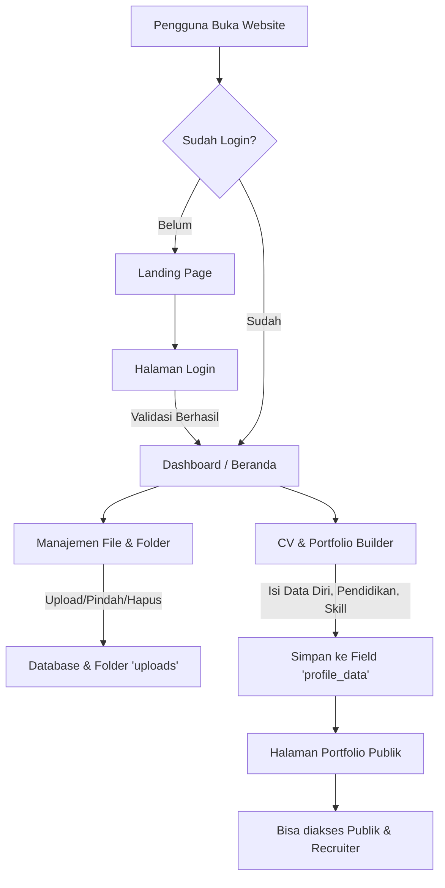

<div align="center">

# 🚀 Alfatih Digital Workspace (Traceface)

### Terorganisir. Profesional. Tanpa Hambatan.

Platform ruang kerja digital berbasis web super lengkap yang menggabungkan **Manajemen File**, **CV & Portfolio Builder**, **Direktori Talenta**, dan **Personal Branding** dalam satu ekosistem terpadu. Dibangun dengan fokus pada kecepatan, keamanan, dan keindahan antarmuka (UI/UX).


</div>

---

## 📖 Tentang Proyek (Metode & Desain)

**Alfatih Digital Workspace (Traceface)** dirancang menggunakan pendekatan *Editorial Minimalist Design* (B&W) dengan sentuhan futuristik. Proyek ini memadukan konsep *Cloud Storage* (seperti Google Drive) dengan *Professional Branding* (seperti LinkedIn).

### Data & Literatur Pendukung
Dalam dunia digital modern, seorang profesional membutuhkan dua hal utama:
1. **Penyimpanan Berbasis Awan (Cloud):** Kemampuan untuk mengakses, mengelola, dan membagikan dokumen kapan saja.
2. **Presentasi Diri (Branding):** Data menunjukkan kandidat dengan portofolio terstruktur memiliki persentase dilirik *recruiter* 70% lebih tinggi. 
Oleh karena itu, sistem ini menggabungkan kedua metodologi tersebut dalam satu platform.

---

## 🏗 Arsitektur Proyek & Teknologi

Proyek ini dibangun menggunakan arsitektur **Monolitik** (Single Codebase) yang efisien, digerakkan oleh **Native PHP 8.x** (Object-Oriented) untuk performa maksimum tanpa *overhead* framework berat.

| Teknologi / Komponen | Fungsi Utama |
| --- | --- |
| **PHP 8.x (Native)** | *Backend logic*, *routing*, penanganan form, koneksi *database*. |
| **MySQLi OOP** | Sistem basis data relasional. |
| **HTML5 & CSS3** | Struktur dan desain antarmuka (*styling* manual tanpa *library* berat). |
| **Vanilla JavaScript** | Penanganan interaksi UI (*drag & drop*, AJAX form submit, animasi). |
| **PWA (Service Worker)** | Memungkinkan web diinstal di HP selayaknya aplikasi *native*. |
| **Google Antigravity IDE**| Alat bantu pengembangan berbasis AI (Agentic Coding) yang membantu *refactoring* dan penyempurnaan proyek secara efisien. |

### 📱 Penjelasan Integrasi Android (APK) / "Nyawa Utama" Android

Jika sistem web ini dikonversi menjadi aplikasi Android (`.apk`), "nyawa utama" atau mesin penggeraknya terdiri dari tiga komponen berikut:

1. **PWA (Progressive Web App):** Anda sudah memiliki `manifest.json` dan `sw.js`. Ini adalah nyawa pertama yang memungkinkan browser (seperti Chrome) menampilkan prompt "Install App". Aplikasi akan masuk ke *home screen* tanpa perlu *coding* Java/Kotlin.
2. **WebView Wrapper (Android Native):** Untuk mengunggah ke Play Store, nyawa utamanya adalah komponen `WebView` di Android Studio (Java/Kotlin). `WebView` berfungsi seperti *browser* transparan di dalam aplikasi yang merender URL website Anda (`https://gawe.my.id`).
3. **Hardware Bridge:** Untuk fitur tingkat lanjut (kamera, notifikasi push, penyimpanan lokal), digunakan *bridge* JavaScript ke Java agar web PHP Anda bisa berkomunikasi langsung dengan perangkat keras ponsel.

---

## 📂 Struktur Pohon File (File Tree)

Berikut adalah anatomi folder dari Traceface:

```text
C:\hosting\
├── actions/                  # File pemrosesan data (Backend Action)
│   └── profile_action.php    # Pemrosesan simpan CV/Portofolio
├── assets/                   # Resource Statis (Front-end)
│   ├── css/                  # File styling antarmuka
│   ├── js/                   # Script interaksi DOM (app.js, dll)
│   └── images/               # Gambar, SVG, Logo
├── config/                   # File konfigurasi sistem (jika ada)
├── core/                     # Plugin dan library eksternal (third-party)
├── uploads/                  # Direktori tempat file pengguna disimpan
│   └── files/                # File dokumen/media unggahan
├── views/                    # Komponen Tampilan (Front-end HTML)
│   ├── components/           # Bagian UI (navbar.php, sidebar.php, modals.php)
│   ├── dashboard/            # Halaman Admin/User (home.php, cv_builder.php)
│   └── pages/                # Halaman Publik (landing_page.php, portfolio_page.php)
├── index.php                 # ENTRY POINT UTAMA (Controller & Router System)
├── manifest.json             # Konfigurasi PWA
├── sw.js                     # Service Worker PWA (Offline caching)
└── README.md                 # Dokumentasi Proyek
```

---

## 🔄 Flowchart Sistem

Berikut adalah alur kerja sistem dari sudut pandang pengguna.



---

## 🛠 Penjelasan Fitur, File, dan Kode Utama

Seluruh logika sistem bermuara pada file raksasa **`index.php`**, yang bertindak sebagai *Front Controller*. 

### 1. Autentikasi (Login & Sesi)
*   **File yang Digunakan:** `index.php`
*   **Baris Kode:** `Baris 173 - 188` (Bagian `// LOGIN`)
*   **Penjelasan:** Menggunakan metode POST `action='login'`. Sistem memverifikasi kecocokan *password* dengan algoritma `password_verify()` PHP dan mengatur `$_SESSION`.
*   **Tampilan:** Diatur di bagian `renderPublicPage()` di dalam `index.php`.

### 2. File & Folder Management (CRUD)
*   **File yang Digunakan:** `index.php` dan `views/dashboard/file_manager.php` (tampilan).
*   **Baris Kode Utama (`index.php`):**
    *   *Upload File:* `Baris 283 - 299` (Menangkap `$_FILES` dan memindahkannya ke direktori `uploads/`).
    *   *Buat Folder:* `Baris 259 - 267` (`INSERT INTO folders`).
    *   *Pindah (Drag & Drop):* `Baris 153 - 159` (Mengupdate nilai `parent_id` menggunakan AJAX JSON).
*   **Teknologi:** PHP PDO/MySQLi untuk eksekusi query, JavaScript Fetch API untuk aksi *Drag & Drop*.

### 3. Akses, Unduh & Cetak Dokumen
*   **File yang Digunakan:** `index.php`
*   **Baris Kode:** `Baris 117 - 132`
*   **Penjelasan:** Fitur ini menutupi URL asli file untuk keamanan. Menggunakan `header('Content-Type')` dan `readfile()` untuk membaca isi *storage* biner, kemudian menampilkannya di *browser* (jika *View/Print*) atau memaksa pengunduhan (jika *Download*).

### 4. CV & Portfolio Builder
*   **File yang Digunakan:** `actions/profile_action.php` (Proses), `views/dashboard/cv_builder.php` (Input), `views/pages/portfolio_page.php` (Output).
*   **Penjelasan:** Karena struktur CV kompleks, data dikonversi dari *form* ke *array* PHP, kemudian di-*encode* menjadi format JSON `json_encode()` dan disimpan di tabel `users` pada kolom `profile_data`. Saat halaman portofolio publik diakses (`index.php?portfolio=username`), data JSON tersebut di-*decode* untuk dirender di layar.

---

## 💻 Tutorial Pemasangan (Instalasi Sistem)

Ikuti langkah-langkah berikut untuk memasang aplikasi Alfatih Digital Workspace di server lokal (XAMPP/Laragon) atau Hosting CPanel:

1. **Persiapan Database:**
   * Buat *database* MySQL kosong (misal: `db_workspace`).
   * *Import* file SQL bawaan ke dalam *database* tersebut (jika ada) agar struktur tabel terbentuk.

2. **Konfigurasi File `index.php`:**
   * Buka file `index.php` menggunakan teks editor (VS Code).
   * Temukan baris `10` sampai `14`.
   * Sesuaikan dengan kredensial *database* Anda:
     ```php
     define('DB_HOST', 'localhost');
     define('DB_USER', 'root'); // Username database Anda
     define('DB_PASS', '');     // Password database Anda
     define('DB_NAME', 'db_workspace'); // Nama database Anda
     define('SITE_URL', 'http://localhost/hosting'); // URL web Anda
     ```

3. **Pengaturan Izin Akses Direktori (Permissions):**
   * Pastikan folder `uploads/` dan `uploads/files/` memiliki izin baca dan tulis (Read & Write / `CHMOD 755` atau `777` di hosting Linux).

4. **Menjalankan Sistem:**
   * Jika menggunakan XAMPP, simpan seluruh folder di dalam `htdocs/hosting/`.
   * Buka browser dan ketik `http://localhost/hosting`.
   * Anda akan melihat halaman *Landing Page*. Silakan login menggunakan akun yang sudah diatur di database (atau daftarkan melalui script jika tersedia).

---

<div align="center">
<b>Alfatih Digital Workspace</b><br>
Dibangun dengan ☕ dan dedikasi untuk profesionalisme digital.
</div>
