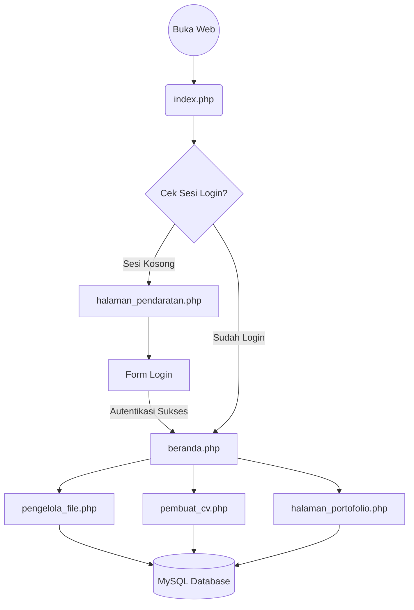

# 🕵️‍♀️ Alfatih Digital Workspace (Traceface): Platform Manajemen Terpadu

Alfatih Digital Workspace (Traceface) adalah sebuah platform web komprehensif yang dirancang khusus untuk memfasilitasi publik dan admin dalam manajemen file (*Cloud Storage*), pembuatan *CV & Portfolio Builder*, serta direktori talenta profesional.

Proyek ini dibangun dan dirancang dengan mengedepankan performa tinggi melalui arsitektur Monolitik PHP Native, guna memastikan akses data super cepat dan kompatibilitas di segala perangkat.

   

---

## 1. Arsitektur Proyek

Proyek ini menggunakan pola arsitektur **Monolitik (Front Controller)**. Semua lalu lintas web bermuara ke satu pintu masuk utama (`index.php`), yang kemudian melakukan *routing* ke komponen tampilan (`tampilan/`) atau memproses logika *backend* (`aksi/`).



---

## 2. Alur Aplikasi (Sequence Diagram)

Berikut adalah interaksi fungsionalitas utama antar pengguna dan sistem (contoh: Alur Pembuatan Portofolio).

```mermaid
sequenceDiagram
    participant P as Pengguna
    participant TF as Workspace (UI)
    participant DB as Database
    participant Pb as Publik (Recruiter)

    rect rgb(30, 30, 30)
    Note over P, DB: [1] Pengisian Data CV & Profil
    P->>TF: Buka Halaman Pembuat CV
    TF->>P: Tampilkan Form Input
    P->>TF: Isi Data (Pendidikan, Skill, dll) & Simpan
    TF->>DB: Kirim Payload JSON ke aksi_profil.php
    DB-->>TF: Update tabel `users` sukses
    TF-->>P: Tampilkan Notifikasi Berhasil
    end

    rect rgb(40, 40, 40)
    Note over P, Pb: [2] Akses Portofolio Publik
    Pb->>TF: Akses URL (index.php?portfolio=username)
    TF->>DB: Query pencarian profil
    DB-->>TF: Return data JSON
    TF->>TF: Decode JSON & Render Halaman
    TF-->>Pb: Tampilkan Halaman Portofolio Profesional
    end
```



---

## 3. Struktur Direktori & Pohon File

```text
hosting/
├── aksi/                         # Logika pemrosesan data (Backend Action)
│   ├── aksi_autentikasi.php      # Verifikasi Login/Logout
│   ├── aksi_file.php             # Logika upload/hapus dokumen
│   ├── aksi_pengguna.php         # Manajemen admin (Superadmin)
│   └── aksi_profil.php           # Pemrosesan JSON pembuat CV
├── aset/                         # Resource Statis (Front-end)
│   ├── css/                      # File styling antarmuka
│   ├── js/                       # Script interaksi DOM (Drag & Drop)
│   └── images/                   # Gambar, SVG, Logo
├── tampilan/                     # Komponen Tampilan (Front-end HTML)
│   ├── dasbor/                   # Halaman internal setelah login
│   │   ├── beranda.php           # Dasbor kendali utama
│   │   ├── pembuat_cv.php        # Form input data diri
│   │   ├── pengelola_file.php    # Manajemen file cloud storage
│   │   └── pengelola_pengguna.php # Pengaturan akun (Admin)
│   ├── halaman/                  # Halaman untuk publik
│   │   ├── halaman_pendaratan.php # Landing page (Pintu masuk)
│   │   └── halaman_portofolio.php # Resume online publik
│   └── komponen/                 # Potongan UI (Navbar, Sidebar, Modals)
├── unggahan/                     # Direktori penyimpanan fisik file
├── index.php                     # [Pintu Masuk] Front Controller & Router
├── manifest.json                 # Konfigurasi PWA (Progressive Web App)
├── sw.js                         # Service Worker PWA (Offline caching)
└── README.md                     # Dokumentasi Proyek
```

---

## 4. Penjelasan Integrasi Android ("Nyawa Utama")

Meskipun ini adalah sistem Web PHP, proyek ini telah didesain agar siap dikonversi menjadi aplikasi Android (`.apk`). Berikut adalah "nyawa utama" yang dipakai:

- **PWA (Progressive Web App)**: File `manifest.json` dan `sw.js` memungkinkan situs ini diunduh langsung dari *browser* ke *homescreen* HP seperti aplikasi biasa.
- **Android WebView**: Jika dibungkus dengan Android Studio (Java/Kotlin), nyawa utamanya adalah komponen `WebView` yang secara transparan menampilkan antarmuka web ke dalam layar aplikasi *native*.

---

## 5. Penjelasan Kode & Fungsionalitas Penting

Setiap blok fitur memiliki relasi kuat dengan file `index.php` dan folder `aksi/`.

- **Autentikasi (Login)**: Di-handle langsung di dalam `index.php` (baris khusus *POST HANDLERS*). Menggunakan `password_verify()` PHP untuk keamanan ekstra.
- **Penyimpanan File**: Menggunakan API Fetch AJAX di `aset/js/app.js` yang mengirimkan data ke `index.php`, lalu file fisik dipindahkan ke folder `unggahan/`.
- **Database (MySQL)**: Terkoneksi menggunakan metode `mysqli` OOP dengan karakter *encoding* `utf8mb4`.

---

## 6. Tutorial Pemasangan Lokal

1. Instal XAMPP / Laragon di komputer Anda.
2. Pindahkan seluruh folder `hosting/` ke dalam folder `htdocs/`.
3. Buat *database* baru di MySQL (misal: `db_workspace`) dan eksekusi file SQL *dump* (jika ada).
4. Buka file `index.php` dengan teks editor.
5. Sesuaikan parameter koneksi di baris awal:
   ```php
   define('DB_HOST', 'localhost');
   define('DB_USER', 'root');
   define('DB_PASS', '');
   define('DB_NAME', 'db_workspace');
   ```
6. Buka *browser* dan akses `http://localhost/hosting`. Sistem siap digunakan!
