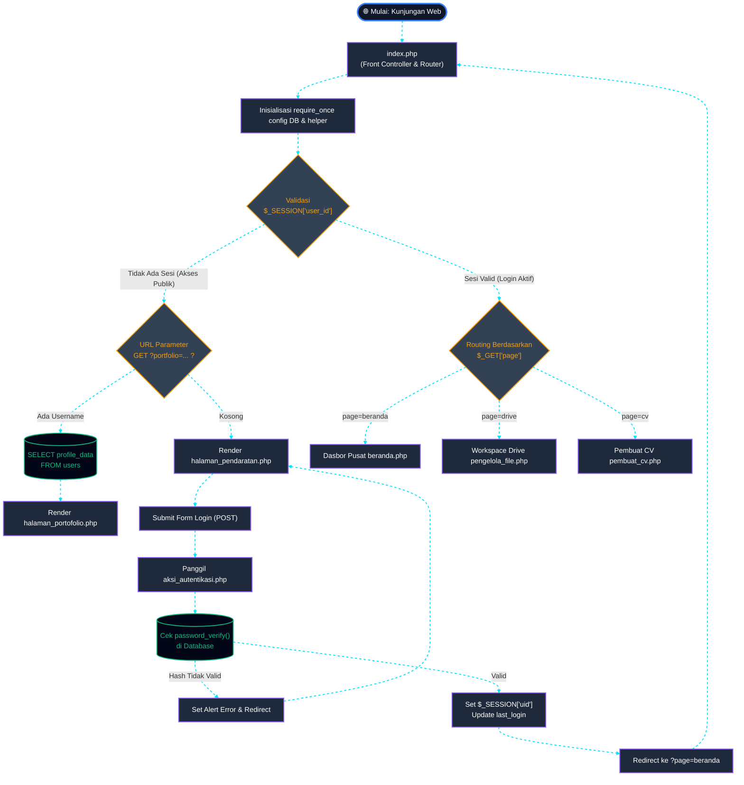
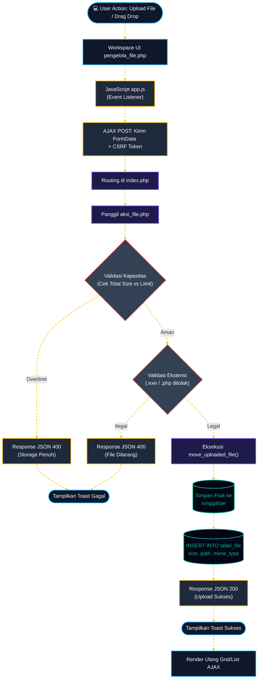
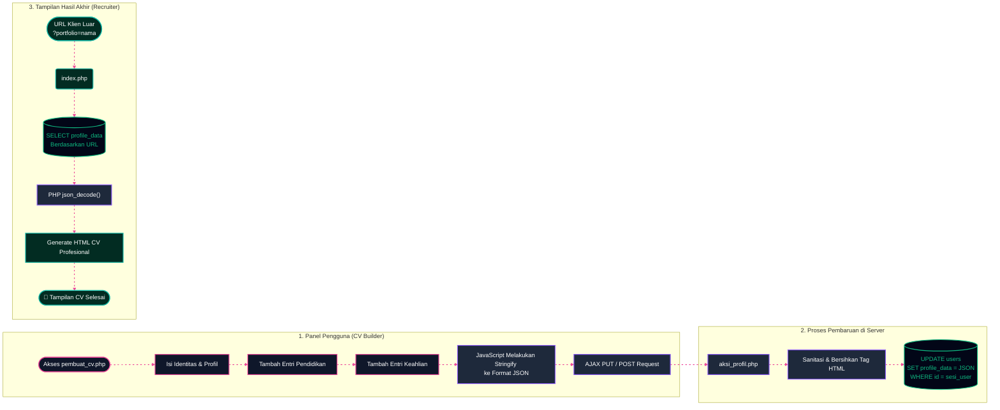

# 🕵️‍♀️ Alfatih Digital Workspace (Traceface)

**Platform Manajemen Terpadu: Cloud Storage, CV Builder, dan Direktori Talenta Profesional.**

Alfatih Digital Workspace (Traceface) adalah sebuah platform web komprehensif yang dirancang dengan estetika modern eksklusif (*Premium Dark SaaS*) untuk memfasilitasi publik dan *admin* dalam manajemen *file*, pembuatan Portofolio/CV secara instan, serta manajemen pengguna dengan fitur tingkat tinggi.

Proyek ini dibangun menggunakan arsitektur **Monolitik PHP Native** yang sangat ringan, memastikan akses super cepat, keamanan tangguh, dan kompatibilitas di segala perangkat (Desktop maupun Mobile).

   

---

## 🌟 Demonstrasi Alur & Fitur Utama (System Flow)

Platform ini dirancang dengan alur kerja (*flow*) yang sangat jelas dari hulu ke hilir. Berikut adalah demonstrasi perjalanan pengguna (User Journey) dari awal hingga akhir:

### 1. Halaman Pendaratan (Landing Page) & Autentikasi
Pintu gerbang utama platform. Pengunjung akan disambut dengan halaman depan yang profesional.
- **Login / Register:** Pengguna dapat mendaftar atau masuk menggunakan sistem autentikasi yang aman (dilengkapi *password hashing*).
- **Akses Publik:** Pengunjung umum dapat mencari portofolio *freelancer*/*talent* tanpa harus *login*.

### 2. Dasbor Utama (Main Dashboard)
Pusat kendali (Command Center) setelah pengguna berhasil *login*.
- **Desain Premium:** Mengusung tema *Dark Mode* dengan gradasi ungu/indigo dan efek *glassmorphism* (kaca).
- **Statistik Cepat:** Menampilkan ringkasan penyimpanan yang digunakan, jumlah *file*, dan status kelengkapan profil.
- **Navigasi Cepat:** Tombol aksi langsung ke *Workspace* (Drive) dan *CV Builder*.

### 3. Workspace / Pengelola File (Google Drive Clone)
Fitur *Cloud Storage* pribadi bergaya *SaaS Premium*.
- **Manajemen File & Folder:** Unggah (*upload*), buat folder baru, ganti nama, hapus, dan pindahkan *file*.
- **Mode Tampilan Ganda:** Dukungan transisi mulus antara **Grid View** (Kartu besar dengan *preview* gambar) dan **List View** (Daftar tabel padat).
- **Context Menu:** Klik kanan interaktif pada *file*/*folder* memunculkan menu *dropdown* mewah.
- **Batas Penyimpanan:** Sistem dilengkapi kalkulasi kuota memori (*storage limit*).

### 4. Pembuat CV & Profil (CV Builder)
Fitur magis untuk membangun halaman portofolio secara otomatis.
- **Formulir Dinamis:** Pengguna mengisi data diri, pendidikan, pengalaman, dan keahlian (*skills*).
- **Penyimpanan JSON:** Semua struktur CV kompleks disimpan dalam basis data secara dinamis menggunakan payload JSON untuk fleksibilitas tinggi.
- **Real-time:** Setiap perubahan profil langsung diterapkan pada halaman publik.

### 5. Portofolio Publik (Public Showcase)
Hasil akhir dari *CV Builder*. Halaman ini berfungsi sebagai kartu nama digital profesional.
- **URL Khusus:** Dapat diakses oleh *recruiter* atau klien melalui parameter URL khusus (contoh: `?portfolio=username`).
- **Desain Responsif:** *Layout* CV diatur sedemikian rupa agar sangat mudah dibaca di layar HP maupun laptop.

### 6. Mode Admin (God Mode)
Hak akses tertinggi (*Super Admin*) untuk mengelola ekosistem.
- **Manajemen Pengguna:** Admin dapat melihat daftar seluruh pengguna, mengedit status, atau menghapus akun pelanggar.
- **Pemantauan Kapasitas:** Admin dapat melihat beban memori di *server*.

---

## 🏗️ Arsitektur & Alur Kerja Sistem (System Workflows)

Proyek ini dibangun dengan arsitektur **Monolitik (Front Controller)**, di mana `index.php` bertindak sebagai pintu masuk tunggal (Single Entry Point) yang mengatur seluruh *routing*, keamanan, dan manajemen sesi.

Berikut adalah rincian alur kerja (*flowchart*) untuk setiap fitur utama di platform ini secara komprehensif.

> [!TIP]
> Garis putus-putus berwarna terang yang menghubungkan setiap proses merepresentasikan **"Energy Flow" (Alur Cahaya)** perjalanan data secara asinkron dari awal eksekusi (*Client*) hingga akhir (*Server/Database*).

### 1. Alur Autentikasi, Routing Utama, & Front Controller
Alur ini membedakan secara ketat antara akses **Publik** (tanpa batas akses) dan **Sistem Internal** (harus login). Semua proses bermuara di `index.php`.



### 2. Alur Pengelola File (Cloud Storage Workspace)
Ini adalah anatomi lengkap manajemen file, meliputi keamanan, unggahan (*upload*), limitasi kuota, hingga eksekusi asinkron menggunakan *AJAX Vanilla*.



### 3. Alur Pembuat CV, Data JSON, & Direktori Portofolio Publik
Alur ini sangat unik karena data tidak disimpan di banyak tabel berbeda, melainkan menggunakan satu payload JSON yang sangat masif dan fleksibel.



## 📂 Struktur Direktori Tingkat Lanjut

Proyek ini dibangun berdasarkan prinsip *Separation of Concerns* (Pemisahan Tanggung Jawab) antara sisi antarmuka (*Front-end View*), logika pemrosesan (*Backend Action*), dan *routing* utama (*Controller*). Berikut adalah rincian lengkap struktur direktori tanpa masalah penjajaran spasi:

```text
hosting/
│
├── [Sistem Utama]
│   ├── index.php                  - Front Controller: Mengatur 100% routing, sesi login, dan HTTP requests.
│   ├── manifest.json              - Web App Manifest: Konfigurasi nama, ikon, dan tema saat diinstall (PWA).
│   └── sw.js                      - Service Worker: Bertugas melakukan caching file agar web bisa offline (PWA).
│
├── aksi/                          - Direktori Backend (Memproses data & Query ke MySQL)
│   ├── aksi_autentikasi.php       - Menangani proses Login, Registrasi, Logout, dan Hash Password.
│   ├── aksi_file.php              - Menangani CRUD file Workspace (Upload, Rename, Hapus, Pindah).
│   ├── aksi_pengguna.php          - [God Mode] Menangani operasi Admin untuk menghapus/edit akun lain.
│   └── aksi_profil.php            - Menangkap input Form CV Builder dan mengubahnya menjadi Payload JSON.
│
├── aset/                          - Direktori Front-end (Resource Statis UI)
│   ├── css/
│   │   └── style.css              - Styling utama selain framework, mengatur Glassmorphism & Dark Mode.
│   ├── js/
│   │   └── app.js                 - Skrip AJAX (Vanilla JS) untuk asinkronisasi Drive & Drag-n-Drop.
│   └── images/                    - Menyimpan ikon web, logo SVG, dan placeholder gambar.
│
├── tampilan/                      - Direktori View (Antarmuka Pengguna HTML/PHP)
│   ├── dasbor/                    - Modul Internal (Hanya bisa diakses setelah Login)
│   │   ├── beranda.php            - Dasbor Pusat: Menampilkan statistik, kuota, & shortcut.
│   │   ├── pembuat_cv.php         - CV Builder: Form dinamis untuk membuat Portofolio (Pendidikan, Keahlian).
│   │   ├── pengelola_file.php     - Google Drive Clone: Antarmuka cloud storage, grid/list view.
│   │   └── pengelola_pengguna.php - God Mode Panel: Antarmuka khusus Superadmin mengelola pengguna.
│   │
│   ├── halaman/                   - Modul Publik (Bisa diakses siapa saja)
│   │   ├── halaman_pendaratan.php - Landing Page: Pintu depan pemasaran dan perkenalan platform.
│   │   └── halaman_portofolio.php - Public Showcase: Hasil akhir CV pengguna yang ditampilkan indah ke klien.
│   │
│   └── komponen/                  - Modul Parsial (Potongan UI yang dipanggil berulang-ulang)
│       ├── navbar.php             - Navigasi Atas (Top-bar), breadcrumbs, profile dropdown.
│       ├── sidebar.php            - Menu Samping, Navigasi modul (Dashboard, Workspace, dll).
│       └── modal.php              - Kumpulan jendela popup (Modal) untuk notifikasi/konfirmasi.
│
├── unggahan/                      - [Directory Server] Penyimpanan fisik untuk semua file & foto pengguna.
└── README.md                      - Dokumentasi Utama Proyek (File ini).
```

---
## 📱 Siap Ekosistem Mobile (Android Integration)

Meskipun ini adalah sistem Web PHP, arsitekturnya telah disiapkan sebagai "Nyawa Utama" untuk aplikasi Mobile (Android/iOS):

- **PWA (Progressive Web App)**: Keberadaan `manifest.json` dan `sw.js` memungkinkan situs ini di- *install* langsung dari Google Chrome ke *homescreen* HP menyerupai aplikasi *native* tanpa perlu masuk Play Store.
- **Android WebView Wrapper**: Desain antarmuka sudah 100% responsif (*Mobile First*). Aplikasi web ini bisa dibungkus menggunakan Android Studio (Java/Kotlin) ke dalam komponen `WebView` dan di *build* menjadi format `.apk` / `.aab` yang sangat ringan.

---

## ⚙️ Panduan Instalasi Lokal

1. **Persiapan:** Instal XAMPP / Laragon di komputer Anda.
2. **Kloning Repositori:** Pindahkan seluruh folder `hosting/` ke dalam folder `htdocs/` (atau direktori root server lokal Anda).
3. **Database:** Buat *database* baru di MySQL (misal: `db_workspace`) dan eksekusi skema *database* (import file `.sql` jika tersedia).
4. **Konfigurasi:** Buka file `index.php` menggunakan *text editor* atau IDE Anda.
5. Sesuaikan parameter koneksi pada konfigurasi sistem di baris awal:
   ```php
   define('DB_HOST', 'localhost');
   define('DB_USER', 'root');
   define('DB_PASS', '');
   define('DB_NAME', 'db_workspace');
   ```
6. **Selesai:** Buka *browser* kesayangan Anda dan akses `http://localhost/hosting`. Sistem siap digunakan!

---
*Didesain dan dikembangkan dengan ❤️ untuk masa depan kolaborasi digital.*
